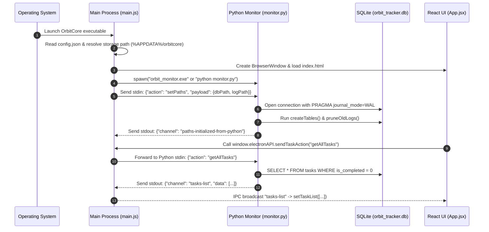
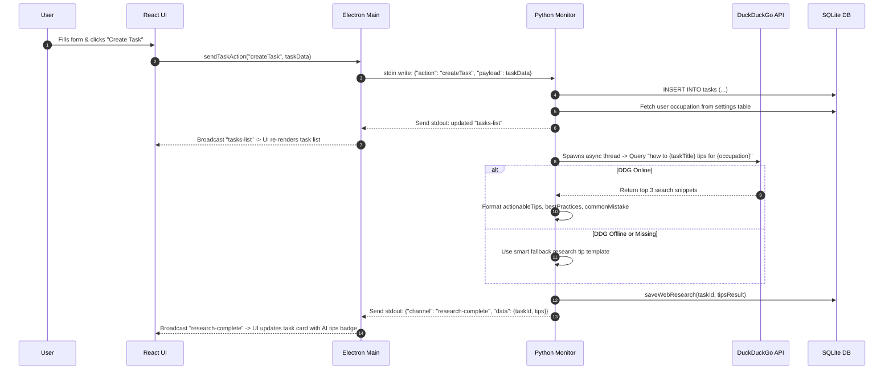
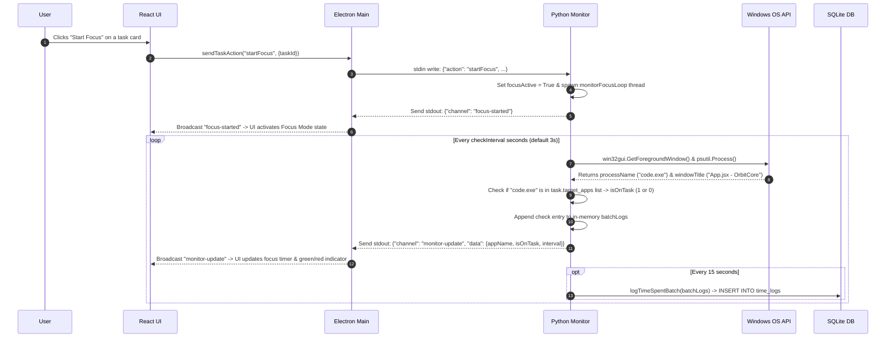

# OrbitCore — Application Lifecycle & Architectural Connections

This document details how every file in the **OrbitCore** codebase connects to each other, how data flows through the application, and the step-by-step execution lifecycle from initial launch to application shutdown.

---

## 1. High-Level Architecture Overview

OrbitCore uses a **hybrid desktop process model**:

```mermaid
graph TD
    A["Electron Main Process (src/main/main.js)"] <-->|IPC Bridge| B["Preload Script (src/preload/preload.js)"]
    B <-->|Context Bridge| C["React 19 Renderer (src/renderer/App.jsx)"]
    A <-->|Stdio IPC (JSON Line Pipe)| D["Python Monitor Subprocess (src/backend/monitor.py)"]
    D <-->|Direct SQL Driver (WAL Mode)| E["SQLite Database (orbit_tracker.db)"]
    D <-->|Win32 / psutil APIs| F["Windows Operating System (Foreground Windows & Processes)"]
```

---

## 2. File Connection & Dependency Map

| File Path | Primary Responsibility | Connected / Imported By | Direct External Dependencies |
| :--- | :--- | :--- | :--- |
| **`src/main/main.js`** | Core process runner, Electron window lifecycle manager, Python subprocess manager, and IPC dispatcher. | Application Entrypoint (Electron Executable) | `electron`, `child_process`, `fs`, `path`, `readline` |
| **`src/preload/preload.js`** | Security wall & IPC bridge. Exposes `window.electronAPI` with whitelisted actions and event listeners. | Loaded by `main.js` in `webPreferences` for `BrowserWindow` | `electron` |
| **`src/backend/db.py`** | SQLite database manager. Creates tables, executes CRUD operations, calculates analytics, and prunes logs. | `src/backend/monitor.py` | `sqlite3`, `json`, `os`, `csv`, `datetime` |
| **`src/backend/monitor.py`** | Background Python process. Listens to stdin from Electron, runs window tracking loop, DDG web research, and audio beeps. | Spawned as child process by `src/main/main.js` | `db.py`, `win32gui`, `win32process`, `psutil`, `duckduckgo_search`, `winsound` |
| **`src/renderer/main.jsx`** | React mounting entry point with global `AppErrorBoundary` wrapper. | Loaded by `index.html` via Vite | `react`, `react-dom` |
| **`src/renderer/App.jsx`** | Root React state container. Manages tabs, window modes (Dashboard vs Orbit 3D), IPC listeners, and toast notifications. | Mounted by `src/renderer/main.jsx` | All UI components, `useTheme.js`, `themes.js` |
| **`src/renderer/themes.js`** | Design system color palette tokens (Dark Teal, Light Teal, Cyberpunk, Nord, Solar, OLED). | `src/renderer/App.jsx`, `useTheme.js` | Pure JS definitions |
| **`src/renderer/hooks/useTheme.js`** | Custom React hook for dynamic CSS variable injection based on active theme choice. | `src/renderer/App.jsx` | `react`, `themes.js` |
| **`src/renderer/components/DashboardView.jsx`** | Main dashboard view. Displays task lists, focus controls, quick task creation, and productivity cards. | Rendered by `src/renderer/App.jsx` (when `activeTab === "tasks"`) | `CollapsiblePanel.jsx`, `AppSelectionModal.jsx` |
| **`src/renderer/components/AnalyticsView.jsx`** | Visual productivity reports: time allocation charts, heatmap, streak tracking, and peak focus hour insights. | Rendered by `src/renderer/App.jsx` (when `activeTab === "analytics"`) | `chart.js`, `react-chartjs-2` |
| **`src/renderer/components/SettingsView.jsx`** | User settings panel: theme selection, data retention, check intervals, data export/import, log viewing. | Rendered by `src/renderer/App.jsx` (when `activeTab === "settings"`) | `useTheme.js` |
| **`src/renderer/components/OrbitView.jsx`** | 3D Solar Orbit mini-widget mode. Renders tasks as orbiting planets around a central sun using Three.js. | Rendered by `src/renderer/App.jsx` (when `currentMode === "orbit"`) | `three` |
| **`src/renderer/components/FirstRunModal.jsx`** | Onboarding wizard modal for new users to configure occupation, default focus settings, and theme. | Rendered by `src/renderer/App.jsx` (when `firstRunComplete` is not true) | React |
| **`src/renderer/components/AppSelectionModal.jsx`** | App picker modal displaying running process names to help users whitelist target applications for tasks. | Rendered by `src/renderer/components/DashboardView.jsx` | React |
| **`src/renderer/components/RemindersOverlay.jsx`** | Floating motivational reminder popup overlay with progress bar countdown. | Rendered by `src/renderer/App.jsx` | React |
| **`src/renderer/components/CollapsiblePanel.jsx`** | Reusable UI container component with collapse/expand toggle persisted to `localStorage`. | Rendered by `DashboardView.jsx`, `AnalyticsView.jsx` | React |

---

## 3. Step-by-Step Application Execution Lifecycle

### Phase 1: Boot & Startup Sequence


---

### Phase 2: Task Creation & DuckDuckGo Web Research Lifecycle


---

### Phase 3: Active Focus Session & Window Tracking Lifecycle


---

### Phase 4: Application Shutdown Sequence
1. User clicks window Close button (`X`) or exits from tray.
2. Electron triggers `app.on("before-quit")`.
3. `main.js` sets `app.isQuitting = true` and calls `pyProcess.kill()`.
4. Python monitor receives process kill signal:
   - Sets `focusActive = False` to break window monitoring and audio beep threads.
   - Flushes any remaining active time logs in `batchLogs` to SQLite.
   - SQLite WAL checkpointing finalizes safely.
5. Electron windows close cleanly with no orphaned subprocesses or corrupted database files.

---

## 4. Complete IPC Channel Reference

### A. Renderer-to-Main Whitelisted Actions (`sendTaskAction`)
- **`getAllTasks`**: Requests all non-completed tasks from SQLite.
- **`createTask`**: Inserts a new task and triggers async web research.
- **`editTask`**: Updates task fields (title, priority, target_apps, etc.).
- **`completeTask`**: Marks a task completed with timestamp.
- **`deleteTask`**: Permanently deletes a task (cascading logs & research).
- **`startFocus`**: Starts active foreground window monitoring for a task.
- **`stopFocus`**: Stops active focus session monitoring loop.
- **`getSettings`**: Retrieves all key-value application configs.
- **`saveSetting`**: Upserts a configuration setting key and value.
- **`getAnalytics`**: Aggregates time logs into chart structures (7d / 30d).
- **`getResearch`**: Retrieves cached DuckDuckGo research for a task.
- **`getTaskTimeBreakdown`**: Fetches total on-task vs off-task seconds for a specific task.
- **`exportLogs`**: Writes focus tracking time logs to Desktop as CSV.
- **`exportSettings`**: Exports settings map to user-selected JSON file.
- **`importSettings`**: Imports settings map from a JSON file.
- **`getFocusMessages`**: Reads custom motivational reminders from `focusModemsgs.txt`.
- **`changeMode`**: Switches window frame mode between `dashboard` and `orbit` 3D.
- **`toggle-orbit-hover`**: Toggles Always-On-Top state for Orbit mini-widget.
- **`set-orbit-opacity`**: Adjusts opacity level of Orbit mini-widget (0.2 - 1.0).
- **`set-orbit-display-mode`**: Sets Orbit display mode (`pinned`, `overlay`, `floating`).
- **`getRunningApps`**: Queries Windows OS tasklist for active `.exe` processes.
- **`getDataDirectory`**: Returns the absolute file system path of the SQLite database.

### B. Main-to-Renderer Broadcast Channels (`onReceiveFromMain`)
- **`tasks-list`**: Emits full array of active task objects.
- **`monitor-update`**: Emits real-time focus log tick data (3s interval).
- **`focus-started` / `focus-stopped`**: Emits focus session activation state changes.
- **`research-complete`**: Emits fetched DuckDuckGo research tips payload.
- **`settings-map`**: Emits updated key-value application settings map.
- **`settings-imported` / `settings-exported`**: Emits export/import operation status.
- **`analytics-data`**: Emits aggregated charts, heatmap, streak, and insights payload.
- **`deadline-reminder`**: Emits upcoming deadline alerts or random focus nudges.
- **`running-apps`**: Emits list of unique active application process names.
- **`data-directory`**: Emits current active storage directory path.
- **`task-time-breakdown`**: Emits time breakdown metrics for single task.
- **`heartbeat`**: Emits daemon pulse every 5s confirming Python backend health.
- **`monitor-status`**: Emits online/offline status of background monitor.
